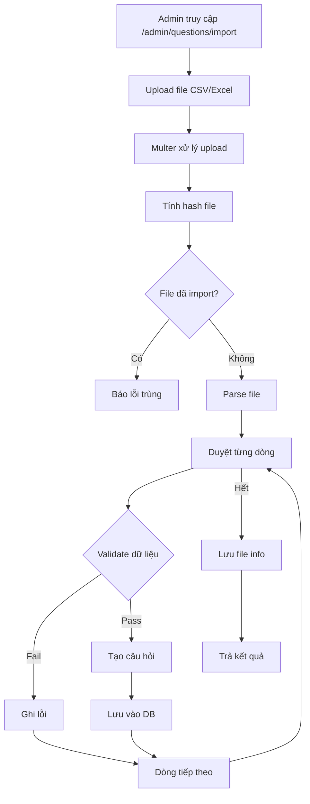

# Chức năng Import Câu Hỏi

Tính năng này cho phép admin import nhiều câu hỏi cùng lúc từ file CSV hoặc Excel.

## Luồng hoạt động



## Các file liên quan

### 1. Controller: [questionmanagecontroller.js](file:///d:/Downloads/OnThiTracNghiem/QuizWeb/apps/controllers/admin/questionmanagecontroller.js)

**Route GET `/admin/questions/import`** (dòng 137-145):
```javascript
router.get("/import", function (req, res) {
  res.render("admin/question-import.ejs", {
    success: null,
    error: null,
    importErrors: null,
    user: req.user,
  });
});
```

**Route POST `/admin/questions/import`** (dòng 147-249):
- Nhận file upload qua `multer`
- Gọi `QuestionService.importQuestions()`
- Lưu file đã import vào thư mục `uploads/imported/`
- Trả về kết quả thành công/thất bại

### 2. Service: [QuestionService.js](file:///d:/Downloads/OnThiTracNghiem/QuizWeb/apps/Services/QuestionService.js)

**Hàm `calculateFileHash(filePath)`** (dòng 519-524):
```javascript
static calculateFileHash(filePath) {
  const fileBuffer = fs.readFileSync(filePath);
  const hashSum = crypto.createHash("sha256");
  hashSum.update(fileBuffer);
  return hashSum.digest("hex");
}
```
- Tính SHA256 hash của file để kiểm tra trùng lặp

**Hàm `importQuestions(filePath, originalName, fileHash)`** (dòng 526-675):

| Bước | Mô tả |
|------|-------|
| 1 | Kiểm tra file đã import chưa qua `isFileImported(fileHash)` |
| 2 | Parse file CSV bằng `_parseCSV()` hoặc Excel bằng `_parseExcel()` |
| 3 | Xác định header row và map columns |
| 4 | Duyệt từng dòng, parse dữ liệu |
| 5 | Validate subject slug tồn tại |
| 6 | Parse JSON `answersJson` |
| 7 | Validate câu hỏi bằng `validateQuestion()` |
| 8 | Normalize answers và tạo document |
| 9 | Lưu vào database |

**Hàm `_parseCSV(filePath)`** (dòng 677-716):
```javascript
_parseCSV(filePath) {
  const content = fs.readFileSync(filePath, "utf-8");
  // Parse CSV thành mảng các dòng
  // Xử lý escape quotes, newlines trong giá trị
}
```

**Hàm `_parseExcel(filePath)`** (dòng 718-723):
```javascript
_parseExcel(filePath) {
  const workbook = XLSX.readFile(filePath);
  const sheetName = workbook.SheetNames[0];
  return XLSX.utils.sheet_to_json(workbook.Sheets[sheetName], { header: 1 });
}
```

### 3. View: [question-import.ejs](file:///d:/Downloads/OnThiTracNghiem/QuizWeb/apps/views/admin/question-import.ejs)

Form upload với:
- Input file accept `.csv,.xlsx,.xls`
- Hiển thị loading overlay khi submit
- Hiển thị danh sách lỗi nếu có

## Cấu trúc file import

### CSV Format
```csv
subjectSlug,type,difficulty,content,answersJson
vat-ly-12,single_choice,easy,"Câu hỏi 1","[{""text"":""A"",""isCorrect"":true},{""text"":""B"",""isCorrect"":false}]"
```

### Các cột bắt buộc

| Cột | Mô tả | Giá trị hợp lệ |
|-----|-------|---------------|
| `subjectSlug` | Slug môn học | Phải tồn tại trong DB |
| `type` | Loại câu hỏi | `single_choice`, `multiple_choice`, `true_false`, `fill_in_blank`, `matching` |
| `difficulty` | Độ khó | `easy`, `medium`, `hard` |
| `content` | Nội dung câu hỏi | Text |
| `answersJson` | Đáp án dạng JSON | Tùy loại câu hỏi |

### Cấu trúc answersJson theo loại

**single_choice / multiple_choice:**
```json
[{"text": "Đáp án A", "isCorrect": true}, {"text": "Đáp án B", "isCorrect": false}]
```

**true_false:**
```json
[{"value": true, "isCorrect": true}, {"value": false, "isCorrect": false}]
```

**fill_in_blank:**
```json
{"accepted": ["đáp án 1", "đáp án 2"]}
```

**matching:**
```json
{"pairs": [{"left": "A", "right": "1"}, {"left": "B", "right": "2"}]}
```

## Xử lý lỗi

- File trùng (đã import): Báo lỗi, không import
- Subject không tồn tại: Bỏ qua dòng đó
- JSON parse lỗi: Bỏ qua dòng đó
- Validate thất bại: Bỏ qua dòng đó

Tất cả lỗi được ghi lại và hiển thị cho admin.
