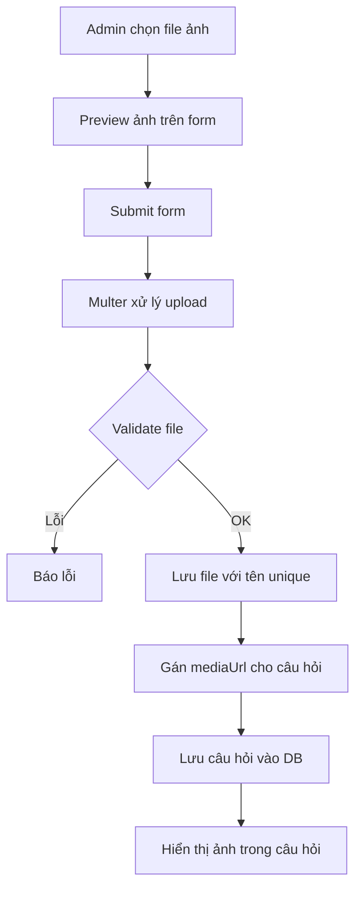

# Chức năng Upload Hình Ảnh Câu Hỏi

Tính năng cho phép admin upload hình ảnh minh họa khi tạo hoặc chỉnh sửa câu hỏi.

## Luồng hoạt động



## Các file liên quan

### 1. Controller: [questionmanagecontroller.js](file:///d:/Downloads/OnThiTracNghiem/QuizWeb/apps/controllers/admin/questionmanagecontroller.js)

**Cấu hình Multer cho upload ảnh** (dòng 26-55):
```javascript
const questionImagesDir = path.join(__dirname, "../../../public/uploads/questions");
if (!fs.existsSync(questionImagesDir)) {
  fs.mkdirSync(questionImagesDir, { recursive: true });
}

var uploadQuestionImage = multer({
  storage: multer.diskStorage({
    destination(req, file, cb) {
      cb(null, questionImagesDir);
    },
    filename(req, file, cb) {
      // Tạo tên file unique: timestamp + random + extension
      const uniqueSuffix = Date.now() + "-" + crypto.randomBytes(4).toString("hex");
      const ext = path.extname(file.originalname);
      cb(null, "question-" + uniqueSuffix + ext);
    },
  }),
  fileFilter(req, file, cb) {
    const allowedTypes = ["image/jpeg", "image/png", "image/gif", "image/webp"];
    if (allowedTypes.includes(file.mimetype)) {
      cb(null, true);
    } else {
      cb(new Error("Chỉ hỗ trợ file ảnh (JPEG, PNG, GIF, WebP)"));
    }
  },
  limits: {
    fileSize: 5 * 1024 * 1024, // 5MB
  }
});
```

**Xử lý upload khi tạo câu hỏi** (dòng 267-302):
```javascript
router.post("/create", function(req, res, next) {
  uploadQuestionImage.single("questionImage")(req, res, function(err) {
    if (err) {
      console.error("Image upload error:", err);
      req.uploadError = err.message;
    }
    next();
  });
}, async function (req, res) {
  // ...
  let mediaUrl = null;
  if (req.file) {
    mediaUrl = "/static/uploads/questions/" + req.file.filename;
  }
  
  const result = await questionService.createQuestion({
    // ...
    mediaUrl: mediaUrl,
    // ...
  });
});
```

### 2. View: [question-create.ejs](file:///d:/Downloads/OnThiTracNghiem/QuizWeb/apps/views/admin/question-create.ejs)

**Form upload ảnh:**
```html
<div class="admin-form-group">
  <label class="admin-form-label">Hình ảnh (tùy chọn)</label>
  <input type="file" name="questionImage" id="questionImage" 
         accept="image/*" class="admin-form-input" />
  <div id="imagePreview" style="margin-top: 10px; display: none;">
    
    <button type="button" onclick="removeImage()">Xóa ảnh</button>
  </div>
</div>
```

**JavaScript preview ảnh:**
```javascript
document.getElementById('questionImage').addEventListener('change', function(e) {
  const file = e.target.files[0];
  if (file) {
    const reader = new FileReader();
    reader.onload = function(e) {
      document.getElementById('previewImg').src = e.target.result;
      document.getElementById('imagePreview').style.display = 'block';
    };
    reader.readAsDataURL(file);
  }
});
```

### 3. Service: [QuestionService.js](file:///d:/Downloads/OnThiTracNghiem/QuizWeb/apps/Services/QuestionService.js)

**Lưu mediaUrl khi tạo câu hỏi** (dòng 366-375):
```javascript
const questionDoc = {
  subjectId: new ObjectId(String(question.subjectId)),
  difficulty: question.difficulty,
  type: question.type,
  content: question.content.trim(),
  mediaUrl: question.mediaUrl || null,  // <-- Lưu URL ảnh
  answers: normalizedAnswers,
  createdAt: new Date(),
  updatedAt: new Date(),
};
```

## Thư mục lưu trữ

| Thư mục | Đường dẫn | Mục đích |
|---------|-----------|----------|
| Ảnh câu hỏi | `public/uploads/questions/` | Lưu file ảnh upload |
| URL truy cập | `/static/uploads/questions/` | Đường dẫn public |

## Quy tắc đặt tên file

Format: `question-{timestamp}-{random}.{ext}`

Ví dụ: `question-1704700000000-a1b2c3d4.png`

## Hiển thị ảnh trong bài thi

### View: [take.ejs](file:///d:/Downloads/OnThiTracNghiem/QuizWeb/apps/views/exam/take.ejs)

```html
<% if (question.mediaUrl) { %>
  <div class="exam-question-media">
    " alt="Hình minh họa" 
         style="max-width: 100%; border-radius: 8px;" />
  </div>
<% } %>
```

## Giới hạn

| Loại | Giới hạn |
|------|----------|
| Kích thước tối đa | 5MB |
| Định dạng hỗ trợ | JPEG, PNG, GIF, WebP |
| Tự động tạo thư mục | Có |

## Xử lý ảnh khi edit câu hỏi

Khi chỉnh sửa câu hỏi có ảnh:
1. Hiển thị ảnh hiện tại
2. Cho phép xóa ảnh cũ
3. Upload ảnh mới thay thế
4. Giữ nguyên ảnh cũ nếu không upload
