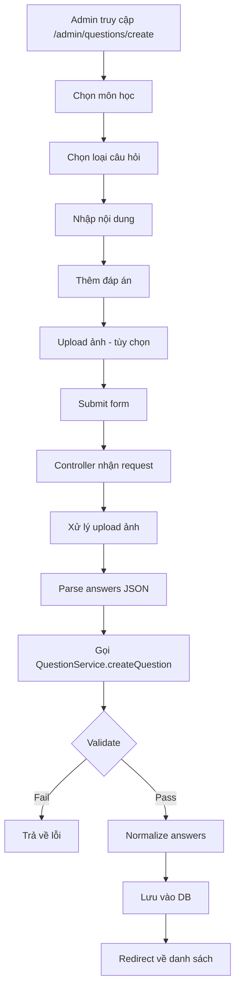

# Chức năng Tạo Câu Hỏi Mới

Tính năng cho phép admin tạo từng câu hỏi đơn lẻ với nhiều loại: trắc nghiệm, đúng/sai, điền khuyết, nối cặp.

## Luồng hoạt động



## Các file liên quan

### 1. Controller: [questionmanagecontroller.js](file:///d:/Downloads/OnThiTracNghiem/QuizWeb/apps/controllers/admin/questionmanagecontroller.js)

**Route GET `/admin/questions/create`** (dòng 252-265):
```javascript
router.get("/create", async function (req, res) {
  try {
    const subjectService = new SubjectService();
    const subjects = await subjectService.getAllSubjects();
    res.render("admin/question-create.ejs", {
      subjects: subjects,
      error: null,
      user: req.user,
    });
  } catch (e) {
    res.status(500).send("Lỗi server");
  }
});
```

**Route POST `/admin/questions/create`** (dòng 267-329):
```javascript
router.post("/create", function(req, res, next) {
  // Xử lý upload ảnh trước
  uploadQuestionImage.single("questionImage")(req, res, function(err) {
    if (err) req.uploadError = err.message;
    next();
  });
}, async function (req, res) {
  // Kiểm tra upload error
  if (req.uploadError) {
    return res.render("admin/question-create.ejs", { error: req.uploadError });
  }
  
  // Tạo mediaUrl nếu có ảnh
  let mediaUrl = null;
  if (req.file) {
    mediaUrl = "/static/uploads/questions/" + req.file.filename;
  }
  
  // Gọi service tạo câu hỏi
  const questionService = new QuestionService();
  const result = await questionService.createQuestion({
    subjectId: req.body.subjectId,
    difficulty: req.body.difficulty,
    type: req.body.type,
    content: req.body.content,
    mediaUrl: mediaUrl,
    answers: JSON.parse(req.body.answers || "[]"),
  });
  
  if (!result.ok) {
    // Xóa ảnh đã upload nếu tạo thất bại
    if (req.file && fs.existsSync(req.file.path)) {
      fs.unlinkSync(req.file.path);
    }
    return res.render("admin/question-create.ejs", { error: result.message });
  }
  
  return res.redirect("/admin/questions?success=created");
});
```

### 2. Service: [QuestionService.js](file:///d:/Downloads/OnThiTracNghiem/QuizWeb/apps/Services/QuestionService.js)

**Hàm `validateQuestion(question)`** (dòng 311-350):
```javascript
static validateQuestion(question) {
  if (!question) {
    return { ok: false, message: "Question không được để trống" };
  }

  // Validate subjectId
  if (!question.subjectId) {
    return { ok: false, message: "SubjectId không được để trống" };
  }
  try {
    new ObjectId(String(question.subjectId));
  } catch (e) {
    return { ok: false, message: "SubjectId không hợp lệ" };
  }

  // Validate difficulty
  const validDifficulties = ["easy", "medium", "hard"];
  if (!question.difficulty || !validDifficulties.includes(question.difficulty)) {
    return { ok: false, message: "Difficulty phải là 'easy', 'medium' hoặc 'hard'" };
  }

  // Validate type
  const validTypes = ["single_choice", "multiple_choice", "true_false", 
                      "fill_in_blank", "matching"];
  if (!question.type || !validTypes.includes(question.type)) {
    return { ok: false, message: "Type không hợp lệ" };
  }

  // Validate content
  if (!question.content || question.content.trim() === "") {
    return { ok: false, message: "Content không được để trống" };
  }

  // Validate answers theo loại câu hỏi
  const answersValidation = QuestionService.validateAnswers(question.type, question.answers);
  if (!answersValidation.ok) {
    return answersValidation;
  }

  return { ok: true };
}
```

**Hàm `createQuestion(question)`** (dòng 353-382):
```javascript
async createQuestion(question) {
  await this.client.connect();
  try {
    // 1. Validate
    const validation = QuestionService.validateQuestion(question);
    if (!validation.ok) {
      return { ok: false, message: validation.message };
    }

    // 2. Normalize answers
    const normalizedAnswers = QuestionService.normalizeAnswers(
      question.type, 
      question.answers
    );

    // 3. Tạo document
    const questionDoc = {
      subjectId: new ObjectId(String(question.subjectId)),
      difficulty: question.difficulty,
      type: question.type,
      content: question.content.trim(),
      mediaUrl: question.mediaUrl || null,
      answers: normalizedAnswers,
      createdAt: new Date(),
      updatedAt: new Date(),
    };

    // 4. Lưu vào DB
    const result = await this.questionRepo.create(questionDoc);
    return { ok: true, question: result };
  } finally {
    await this.client.close();
  }
}
```

### 3. View: [question-create.ejs](file:///d:/Downloads/OnThiTracNghiem/QuizWeb/apps/views/admin/question-create.ejs)

Form tạo câu hỏi với các thành phần:

| Trường | Loại | Bắt buộc |
|--------|------|----------|
| Môn học | Select | ✅ |
| Loại câu hỏi | Select | ✅ |
| Độ khó | Select | ✅ |
| Nội dung | Textarea | ✅ |
| Hình ảnh | File | ❌ |
| Đáp án | Dynamic form | ✅ |

## Cấu trúc dữ liệu đáp án theo loại

### single_choice / multiple_choice
```javascript
[
  { text: "Đáp án A", isCorrect: true },
  { text: "Đáp án B", isCorrect: false },
  { text: "Đáp án C", isCorrect: false },
  { text: "Đáp án D", isCorrect: false }
]
```

### true_false
```javascript
[
  { value: true, isCorrect: true },
  { value: false, isCorrect: false }
]
```

### fill_in_blank
```javascript
{
  accepted: ["đáp án 1", "đáp án 2", "đáp án 3"]
}
```

### matching
```javascript
{
  pairs: [
    { left: "Việt Nam", right: "Hà Nội" },
    { left: "Thái Lan", right: "Bangkok" },
    { left: "Nhật Bản", right: "Tokyo" }
  ]
}
```

## Validation đáp án

**Hàm `_validateChoiceAnswers(type, answers)`** (dòng 87-124):
- Phải có ít nhất 2 đáp án
- Phải có ít nhất 1 đáp án đúng
- `single_choice`: chỉ được 1 đáp án đúng
- `multiple_choice`: được nhiều đáp án đúng

**Hàm `_validateTrueFalseAnswers(answers)`** (dòng 126-157):
- Phải có đúng 2 đáp án: true và false
- Phải có 1 đáp án đúng

**Hàm `_validateFillInBlankAnswers(answers)`** (dòng 159-180):
- Phải có `accepted` là mảng
- Mảng phải có ít nhất 1 phần tử

**Hàm `_validateMatchingAnswers(answers)`** (dòng 182-209):
- Phải có `pairs` là mảng
- Mỗi pair phải có `left` và `right`
- Phải có ít nhất 2 cặp

## Dynamic Form UI

JavaScript xử lý form đáp án động dựa trên loại câu hỏi được chọn:

```javascript
document.getElementById('type').addEventListener('change', function() {
  const type = this.value;
  // Ẩn/hiện các section đáp án tương ứng
  showAnswerSection(type);
});
```

Các section đáp án:
- `#choiceAnswers`: Cho single_choice, multiple_choice
- `#trueFalseAnswers`: Cho true_false
- `#fillBlankAnswers`: Cho fill_in_blank
- `#matchingAnswers`: Cho matching
