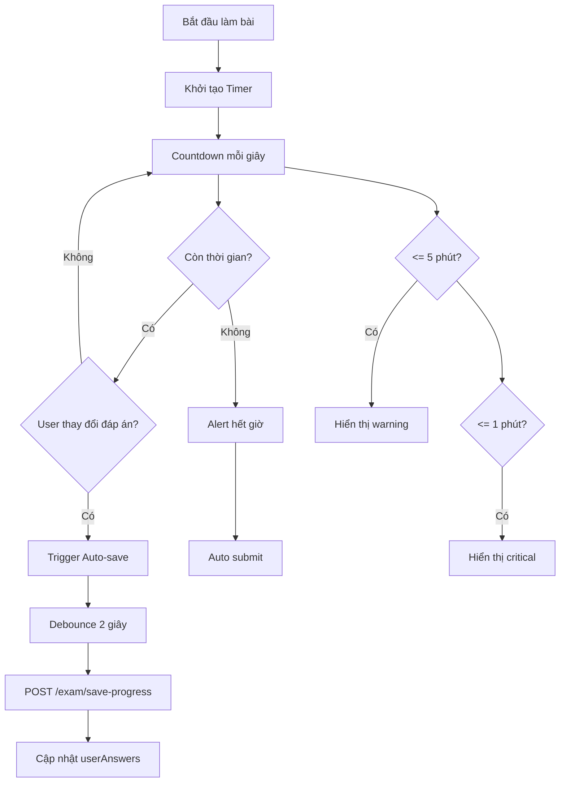
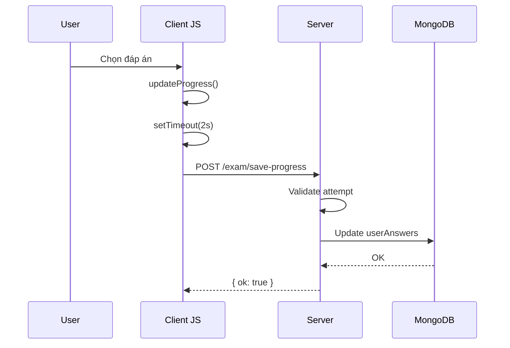

# Chức năng Đếm Thời Gian và Lưu Tiến Trình Thi

Tính năng quản lý countdown timer và auto-save câu trả lời trong quá trình làm bài.

## Luồng hoạt động



## Các file liên quan

### 1. JavaScript Client: [exam-take.js](file:///d:/Downloads/OnThiTracNghiem/QuizWeb/public/js/exam-take.js)

#### Khởi tạo Timer (dòng 12-19)
```javascript
let remainingSeconds = parseInt(
  examForm.dataset.remainingSeconds || 
  (parseInt(examForm.dataset.durationMinutes || "0") * 60)
);

const timerElement = document.getElementById("examTimer");
const timerTextElement = document.getElementById("timerText");
const timerWarningElement = document.getElementById("exam-timer-warning");
```

#### Format thời gian (dòng 21-26)
```javascript
function formatTime(seconds) {
  if (seconds < 0) return "00:00";
  const mins = Math.floor(seconds / 60);
  const secs = seconds % 60;
  return `${String(mins).padStart(2, "0")}:${String(secs).padStart(2, "0")}`;
}
```

#### Cập nhật Timer mỗi giây (dòng 28-50)
```javascript
function updateTimer() {
  if (!timerTextElement) return;
  
  timerTextElement.textContent = formatTime(remainingSeconds);

  // Warning: còn <= 5 phút
  if (remainingSeconds <= 300) {
    if (timerElement) timerElement.classList.add("exam-timer--warning");
  }

  // Critical: còn <= 1 phút
  if (remainingSeconds <= 60) {
    if (timerElement) {
      timerElement.classList.remove("exam-timer--warning");
      timerElement.classList.add("exam-timer--critical");
    }
  }

  // Hết giờ: auto submit
  if (remainingSeconds <= 0) {
    clearInterval(timerInterval);
    autoSubmitExam();
    return;
  }
  remainingSeconds--;
}

// Chạy mỗi giây
const timerInterval = setInterval(updateTimer, 1000);
updateTimer(); // Cập nhật ngay lập tức
```

#### Trigger Auto-save với Debounce (dòng 97-103)
```javascript
let saveTimeout;

function triggerAutoSave() {
  updateProgress();
  clearTimeout(saveTimeout);
  saveTimeout = setTimeout(saveProgressToServer, 2000); // Debounce 2 giây
}
```

#### Gọi API lưu tiến trình (dòng 105-117)
```javascript
async function saveProgressToServer() {
  const answers = transformFormData();
  try {
    const res = await fetch("/exam/save-progress", {
      method: "POST",
      headers: { "Content-Type": "application/json" },
      body: JSON.stringify({ attemptId, answers }),
    });
    if (!res.ok) console.warn("Auto-save failed");
  } catch (e) {
    console.warn("Auto-save error", e);
  }
}
```

#### Event listeners cho auto-save (dòng 254-292)
```javascript
// Khi thay đổi radio/checkbox
examForm.addEventListener("change", (e) => {
  if (e.target.matches('input[type="radio"], input[type="checkbox"]')) {
     updateAnswerVisualState(e.target);
     triggerAutoSave();
  }
});

// Khi nhập text (fill_in_blank)
examForm.addEventListener("input", (e) => {
  if (e.target.matches('input[type="text"]')) {
     triggerAutoSave();
  }
});

// Khi kéo thả xong (matching)
draggable.addEventListener('dragend', () => {
  draggable.classList.remove('dragging');
  triggerAutoSave();
});
```

#### Auto submit khi hết giờ (dòng 209-214)
```javascript
function autoSubmitExam() {
  alert("Hết giờ làm bài! Hệ thống đang tự động nộp bài của bạn.");
  const inputs = examForm.querySelectorAll("input, button");
  inputs.forEach((i) => (i.disabled = true));
  doSubmit();
}
```

### 2. Controller: [examcontroller.js](file:///d:/Downloads/OnThiTracNghiem/QuizWeb/apps/controllers/examcontroller.js)

**Route POST `/exam/save-progress`** (dòng 88-106):
```javascript
router.post("/save-progress", optionalAuth, async function (req, res) {
  try {
    const user = req.user || null;
    const { attemptId, answers } = req.body;

    if (!hasPermission(user, "exams.take")) {
      return res.status(403).json({ ok: false, message: "Unauthorized" });
    }

    const service = new ExamService();
    const result = await service.saveProgress(attemptId, user, answers);
    res.json(result);
  } catch (e) {
    console.error("Error saving progress:", e);
    res.status(500).json({ ok: false, message: "Server error" });
  }
});
```

### 3. Service: [ExamService.js](file:///d:/Downloads/OnThiTracNghiem/QuizWeb/apps/Services/ExamService.js)

**Hàm `saveProgress(attemptId, user, answers)`** (dòng 336-362):
```javascript
async saveProgress(attemptId, user, answers) {
  await this.client.connect();
  try {
    // Lấy attempt
    const attempt = await this.examAttemptRepo.getById(attemptId);
    if (!attempt) return { ok: false, message: "Không tìm thấy attempt" };

    // Kiểm tra đã kết thúc chưa
    if (attempt.finishedAt)
      return { ok: false, message: "Bài thi đã kết thúc" };

    // Kiểm tra quyền sở hữu
    if (
      user &&
      user.userId &&
      attempt.userId &&
      String(attempt.userId) !== String(user.userId)
    ) {
      return { ok: false, message: "Không có quyền" };
    }

    // Cập nhật userAnswers
    await this.examAttemptRepo.updateAttempt(attemptId, {
      userAnswers: answers,
    });

    return { ok: true };
  } finally {
    await this.client.close();
  }
}
```

## Cấu trúc Timer UI

### HTML trong [take.ejs](file:///d:/Downloads/OnThiTracNghiem/QuizWeb/apps/views/exam/take.ejs)
```html
<div class="exam-timer" id="examTimer">
  <svg class="exam-timer__icon">...</svg>
  <span class="exam-timer__text" id="timerText">30:00</span>
</div>
```

### CSS States
```css
.exam-timer {
  /* Style mặc định */
}

.exam-timer--warning {
  background: var(--color-warning-soft);
  color: var(--color-warning);
  animation: pulse 1s infinite;
}

.exam-timer--critical {
  background: var(--color-danger-soft);
  color: var(--color-danger);
  animation: shake 0.5s infinite;
}
```

## Xử lý Resume bài thi

Khi user quay lại bài thi đang dở (xem [ExamService.generateExam](file:///d:/Downloads/OnThiTracNghiem/QuizWeb/apps/Services/ExamService.js#L31-L75)):

```javascript
if (activeAttempt) {
  const now = new Date();
  const startTime = new Date(activeAttempt.startedAt);
  const durationMs = activeAttempt.durationMinutes * 60 * 1000;
  const endTime = new Date(startTime.getTime() + durationMs);
  const remainingMs = endTime.getTime() - now.getTime();

  if (remainingMs <= 0) {
    // Hết giờ -> auto submit
    await this.submitExam({...}, user);
  } else {
    // Còn giờ -> resume với thời gian còn lại
    return {
      ok: true,
      isResume: true,
      remainingSeconds: Math.floor(remainingMs / 1000),
      userAnswers: activeAttempt.userAnswers || {},
      // ...
    };
  }
}
```

## Thời gian các ngưỡng

| Ngưỡng | Thời gian | Hiệu ứng |
|--------|-----------|----------|
| Bình thường | > 5 phút | Timer xanh |
| Warning | <= 5 phút | Timer vàng + pulse |
| Critical | <= 1 phút | Timer đỏ + shake |
| Hết giờ | 0 | Auto submit |

## Debounce Strategy

| Event | Delay | Lý do |
|-------|-------|-------|
| Radio/Checkbox change | 2s | Tránh spam request |
| Text input | 2s | Chờ user gõ xong |
| Drag-drop end | 2s | Sau khi drop xong |

## Data Flow - Lưu tiến trình



## transformFormData()

Hàm thu thập tất cả câu trả lời từ form (dòng 294-336):

| Loại câu hỏi | Cách lấy đáp án |
|--------------|-----------------|
| single_choice | `radio:checked` -> value |
| multiple_choice | `checkbox:checked` -> array of values |
| true_false | `radio:checked` -> value |
| fill_in_blank | `text input` -> trimmed value |
| matching | `hidden inputs` -> object {left: right} |

## Error Handling

- Network error: Log console warning, không alert user
- Server error: Log console warning
- Attempt không tồn tại: Trả lỗi
- Đã nộp bài: Trả lỗi
- Sai user: Trả lỗi 403
